# OEX — HƯỚNG DẪN NGHIỆP VỤ NGƯỜI DÙNG

> **OEX (Online Examination System)** — Hệ thống thi trắc nghiệm trực tuyến  
> Phiên bản tài liệu: 1.0 · Cập nhật: 17/07/2026

---

## 1. Giới thiệu

Tài liệu này hướng dẫn các nghiệp vụ chính của OEX cho ba nhóm người dùng:

| Vai trò | Nghiệp vụ chính |
|---------|-----------------|
| **Administrator (Admin)** | Tạo, sửa, kích hoạt và vô hiệu hóa tài khoản |
| **Teacher (Giáo viên)** | Quản lý môn học, ngân hàng câu hỏi, đề thi, gán học sinh và xem kết quả |
| **Student (Học sinh)** | Xem đề được gán, làm bài, nộp bài và xem kết quả |

Giao diện hệ thống sử dụng **tiếng Anh**. Tài liệu này trình bày bằng tiếng Việt và giữ nguyên tên nút/menu tiếng Anh để người dùng dễ đối chiếu.

### 1.1. Địa chỉ truy cập

| Môi trường | Địa chỉ |
|------------|---------|
| Ứng dụng web mặc định | `http://localhost:5001` |
| API mặc định | `http://localhost:5002/api/v1` |
| Swagger UI | `http://localhost:5002/api/docs` |

> Địa chỉ thực tế có thể khác khi hệ thống được triển khai trên máy chủ của khách hàng.

### 1.2. Tài khoản minh họa

| Vai trò | Email | Mật khẩu |
|---------|-------|----------|
| Admin | `admin@oex.test` | `Password123!` |
| Teacher | `teacher@oex.test` | `Password123!` |
| Student | `student2@oex.test` | `Password123!` |

> Đây là tài khoản dữ liệu mẫu. Không dùng mật khẩu mẫu trong môi trường production.

---

## 2. Quy trình nghiệp vụ tổng quát

```text
Admin tạo tài khoản
        ↓
Teacher tạo môn học và ngân hàng câu hỏi
        ↓
Teacher tạo đề → thêm câu hỏi → Publish → gán học sinh
        ↓
Student mở My Exams → Start/Resume → chọn đáp án → Submit
        ↓
Hệ thống chấm tự động
        ↓
Student xem điểm; Teacher xem kết quả và chi tiết bài làm
```

### 2.1. Quy tắc nghiệp vụ quan trọng

1. Người dùng không tự đăng ký; **Admin** tạo tài khoản.
2. Giáo viên chỉ quản lý môn học, câu hỏi và đề thi thuộc quyền sở hữu của mình.
3. Mỗi câu hỏi là MCQ và có **đúng một đáp án đúng**.
4. Đề thi phải có câu hỏi và được **Publish** trước khi học sinh có thể làm.
5. Học sinh chỉ thấy đề đã được gán cho tài khoản của mình.
6. Học sinh chỉ làm bài trong khoảng `Open date/time` đến `Close date/time`.
7. Số lần làm bài không vượt quá `Max attempts`.
8. Bài đang làm được lưu đáp án tự động; khi hết thời gian, hệ thống tự nộp bài.
9. Điểm được tính tự động khi nộp.
10. Học sinh chỉ xem đáp án đúng nếu giáo viên bật **Show answers after submit**.

---

## 3. Đăng nhập, đăng xuất và tài khoản

### 3.1. Đăng nhập

1. Mở ứng dụng OEX.
2. Nhập email tại ô **Email address**.
3. Nhập mật khẩu tại ô **Password**.
4. Nhấn **Sign in**.
5. Hệ thống chuyển đến **Dashboard** tương ứng với vai trò.

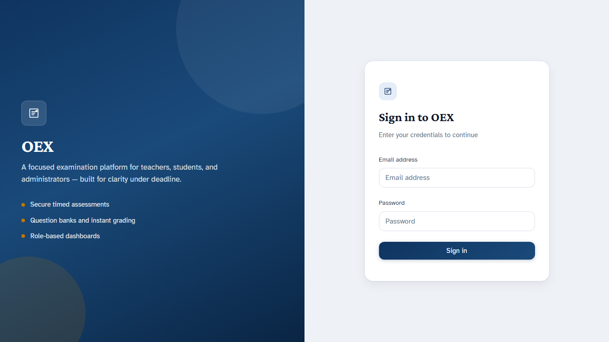

**Kết quả có thể gặp:**

| Tình huống | Kết quả |
|------------|---------|
| Email và mật khẩu đúng | Đăng nhập thành công |
| Sai email hoặc mật khẩu | Hiển thị lỗi thông tin đăng nhập |
| Tài khoản bị vô hiệu hóa | Không cho phép đăng nhập |
| Phiên đăng nhập hết hạn | Chuyển về trang đăng nhập |

### 3.2. Đổi mật khẩu

1. Sau khi đăng nhập, chọn **Account** trên thanh điều hướng.
2. Nhập mật khẩu hiện tại.
3. Nhập mật khẩu mới và xác nhận.
4. Nhấn nút lưu thay đổi.
5. Đăng nhập lại bằng mật khẩu mới nếu hệ thống yêu cầu.

### 3.3. Đăng xuất

Nhấn **Sign out** ở góc trên bên phải. Hệ thống xóa phiên đăng nhập và quay về màn hình đăng nhập.

---

## 4. Nghiệp vụ Admin — Quản lý người dùng

Đăng nhập bằng tài khoản có vai trò **Admin**.

### 4.1. Xem và tìm kiếm người dùng

1. Chọn **User Management** trên menu trái.
2. Chọn vai trò tại bộ lọc **Role** nếu cần.
3. Nhập tên hoặc email tại ô **Search**.
4. Nhấn **Search**.

Danh sách hiển thị tên, email, vai trò, trạng thái và thao tác.

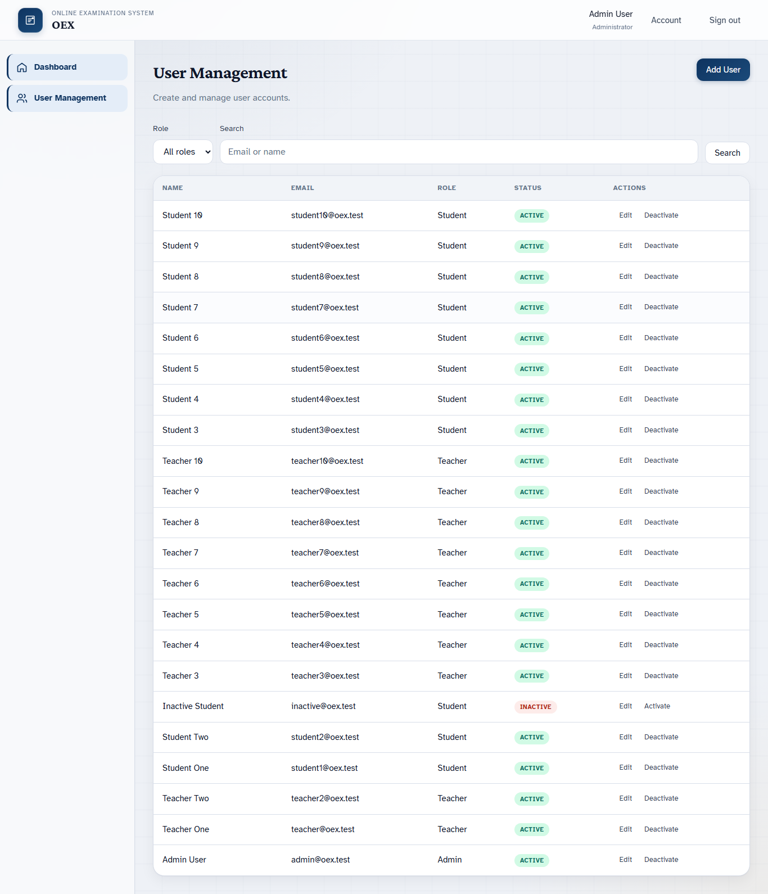

### 4.2. Tạo tài khoản

1. Tại **User Management**, nhấn **Add User**.
2. Nhập:
   - **Full name**: họ tên người dùng.
   - **Email**: email đăng nhập, không được trùng.
   - **Password**: mật khẩu khởi tạo.
   - **Role**: `Admin`, `Teacher` hoặc `Student`.
3. Nhấn nút lưu.
4. Kiểm tra tài khoản mới xuất hiện trong danh sách với trạng thái **ACTIVE**.

**Lưu ý:**

- Email phải đúng định dạng và duy nhất.
- Chỉ cấp vai trò Admin cho người có trách nhiệm quản trị hệ thống.
- Nên yêu cầu người dùng đổi mật khẩu sau lần đăng nhập đầu tiên.

### 4.3. Sửa tài khoản

1. Tìm tài khoản cần sửa.
2. Nhấn **Edit**.
3. Cập nhật họ tên, email hoặc vai trò.
4. Lưu thay đổi.

### 4.4. Vô hiệu hóa hoặc kích hoạt tài khoản

- Nhấn **Deactivate** để khóa tài khoản đang hoạt động.
- Nhấn **Activate** để mở lại tài khoản đã khóa.

Tài khoản **INACTIVE** không thể đăng nhập, kể cả khi thông tin mật khẩu đúng.

### 4.5. Dashboard Admin

Dashboard Admin hiển thị tổng quan người dùng và liên kết nhanh đến chức năng quản lý tài khoản.

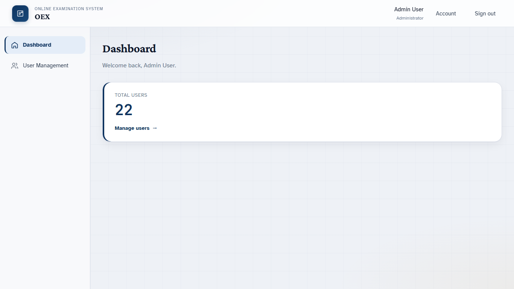

---

## 5. Nghiệp vụ Teacher — Quản lý môn học

Đăng nhập bằng tài khoản có vai trò **Teacher**.

Dashboard Teacher hiển thị tổng số môn học, số đề đang hoạt động và các liên kết truy cập nhanh.

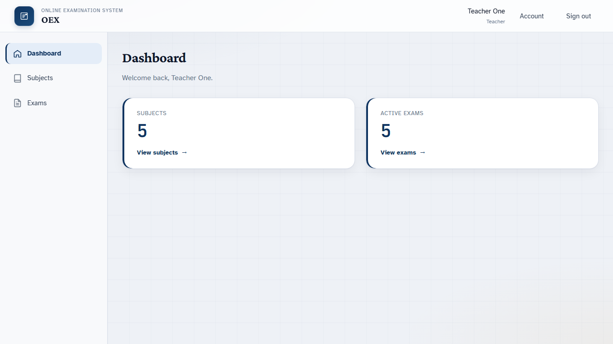

### 5.1. Xem danh sách môn học

Chọn **Subjects** trên menu. Danh sách hiển thị mã môn, tên môn và mô tả.

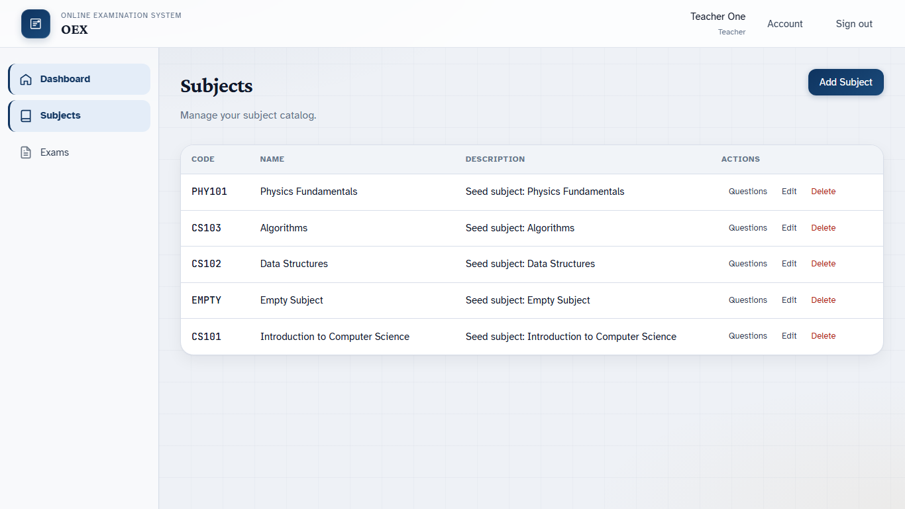

### 5.2. Tạo môn học

1. Nhấn **Add Subject**.
2. Nhập:
   - **Code**: mã môn, ví dụ `CS101`.
   - **Name**: tên môn học.
   - **Description**: mô tả, không bắt buộc.
3. Lưu thông tin.

Mã môn phải duy nhất trong phạm vi các môn do giáo viên quản lý.

### 5.3. Sửa hoặc xóa môn học

- Chọn **Edit** để cập nhật thông tin.
- Chọn **Delete** để xóa khi môn chưa bị ràng buộc bởi dữ liệu không thể xóa.

Kiểm tra kỹ trước khi xóa vì thao tác có thể ảnh hưởng đến câu hỏi và đề thi liên quan.

---

## 6. Nghiệp vụ Teacher — Ngân hàng câu hỏi

### 6.1. Mở ngân hàng câu hỏi

1. Vào **Subjects**.
2. Chọn môn học cần quản lý.
3. Mở **Questions** hoặc **Question Bank**.
4. Có thể tìm theo nội dung và lọc theo độ khó.

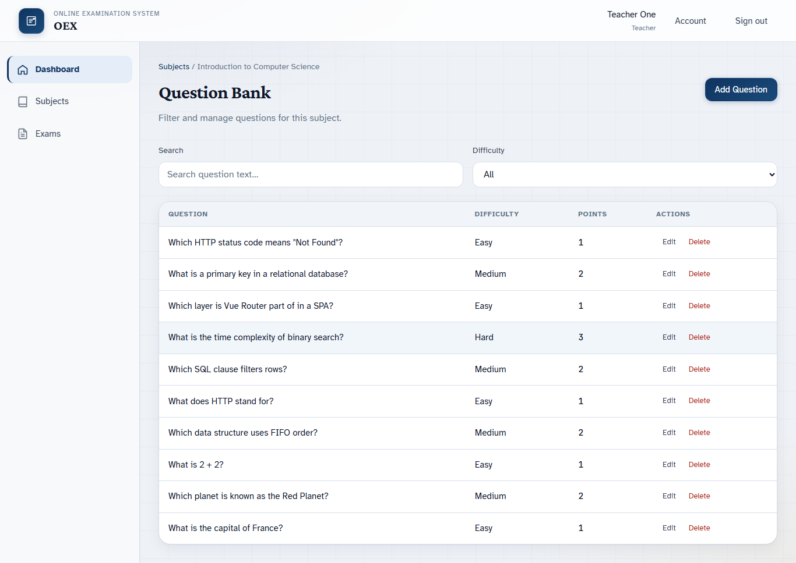

### 6.2. Tạo câu hỏi MCQ

1. Nhấn **Add Question**.
2. Chọn môn học tại **Subject**.
3. Nhập nội dung tại **Question text**.
4. Chọn **Difficulty**:
   - `Easy`
   - `Medium`
   - `Hard`
5. Nhập **Points**.
6. Nhập các phương án trả lời.
7. Chọn **chính xác một** phương án đúng.
8. Lưu câu hỏi.

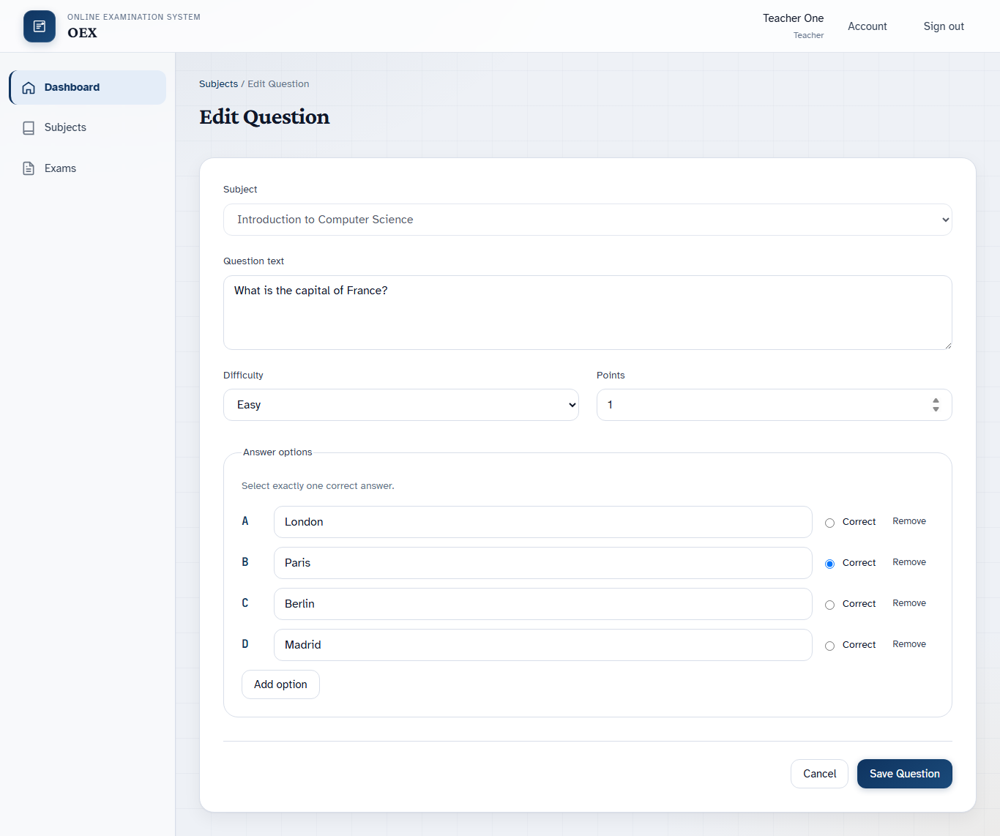

**Điều kiện hợp lệ:**

- Có tối thiểu các phương án theo yêu cầu của biểu mẫu.
- Nội dung phương án không được để trống.
- Chỉ một phương án có trạng thái đúng.
- Điểm phải là giá trị hợp lệ và lớn hơn 0.

### 6.3. Sửa hoặc xóa câu hỏi

- **Edit**: thay đổi nội dung, độ khó, điểm hoặc phương án.
- **Delete**: xóa câu hỏi chưa bị ràng buộc theo quy tắc hệ thống.

Không nên sửa nội dung câu hỏi đã được sử dụng trong một kỳ thi đang diễn ra.

---

## 7. Nghiệp vụ Teacher — Quản lý đề thi

### 7.1. Xem danh sách đề

Chọn **Exams**. Danh sách thể hiện tên đề, môn học, trạng thái, thời gian mở và đóng.

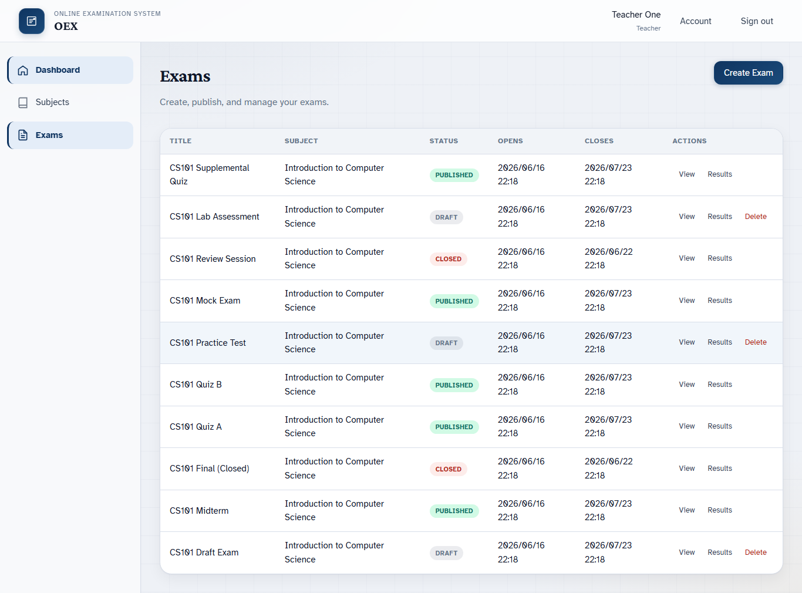

Các trạng thái:

| Trạng thái | Ý nghĩa |
|------------|---------|
| **DRAFT** | Đang soạn, có thể chỉnh sửa |
| **PUBLISHED** | Đã phát hành cho học sinh được gán |
| **CLOSED** | Đã đóng, không nhận bài làm mới |

### 7.2. Tạo đề thi

1. Chọn **Create Exam**.
2. Nhập các trường:
   - **Subject**: môn học.
   - **Title**: tên đề.
   - **Description**: mô tả.
   - **Duration (minutes)**: thời lượng làm bài.
   - **Max attempts**: số lượt làm tối đa.
   - **Open date/time**: thời điểm bắt đầu nhận bài.
   - **Close date/time**: thời điểm kết thúc.
   - **Show answers after submit**: cho phép học sinh xem đáp án sau khi nộp.
3. Lưu để tạo đề ở trạng thái **DRAFT**.

### 7.3. Thêm và sắp xếp câu hỏi

1. Mở đề thi ở trạng thái **DRAFT**.
2. Chọn tab **Questions**.
3. Tìm và chọn câu hỏi từ ngân hàng.
4. Thêm câu hỏi vào đề.
5. Sắp xếp thứ tự câu hỏi nếu cần.
6. Lưu danh sách câu hỏi.

### 7.4. Phát hành đề

Trước khi nhấn **Publish**, kiểm tra:

- Đề có ít nhất một câu hỏi.
- Thời lượng và số lượt làm đúng.
- Thời gian mở nhỏ hơn thời gian đóng.
- Tùy chọn xem đáp án phù hợp.

Sau khi phát hành, cấu hình đề không còn được sửa như khi ở trạng thái Draft.

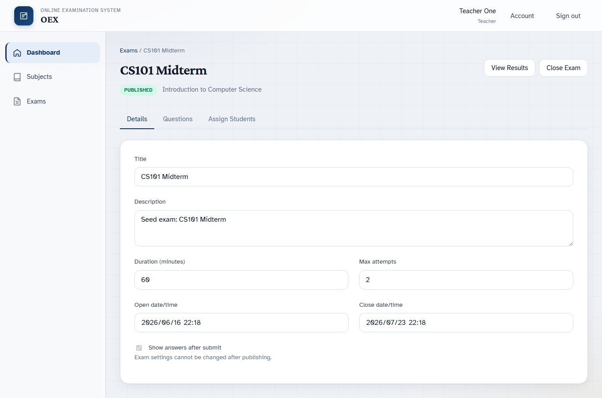

### 7.5. Gán đề cho học sinh

1. Mở đề thi.
2. Chọn tab **Assign Students**.
3. Tìm học sinh theo tên hoặc email.
4. Đánh dấu các học sinh cần gán.
5. Xác nhận gán đề.
6. Kiểm tra danh sách **Assigned students**.

Một học sinh không thể được gán trùng cùng một đề.

### 7.6. Đóng đề

Nhấn **Close Exam** khi không muốn nhận lượt làm mới. Sau khi đóng:

- Học sinh không thể bắt đầu lượt làm mới.
- Danh sách gán chuyển sang chế độ chỉ đọc.
- Giáo viên vẫn có thể xem kết quả.

---

## 8. Nghiệp vụ Student — Xem và làm bài

Đăng nhập bằng tài khoản có vai trò **Student**.

### 8.1. Xem đề được gán

1. Chọn **My Exams**.
2. Kiểm tra tên đề, môn học, thời gian mở/đóng, thời lượng và trạng thái.
3. Thao tác có thể hiển thị:

| Nút / trạng thái | Ý nghĩa |
|------------------|---------|
| **Start** | Bắt đầu lượt làm mới |
| **Resume** | Tiếp tục lượt đang làm |
| **View Result** | Xem kết quả lượt đã nộp |
| Chưa mở / đã đóng | Không thể bắt đầu |

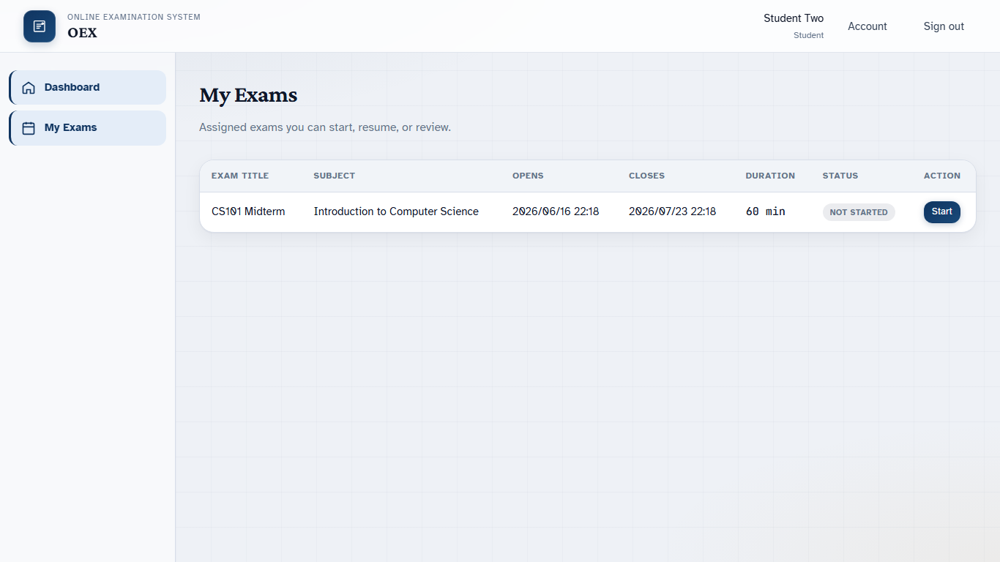

### 8.2. Bắt đầu làm bài

1. Nhấn **Start**.
2. Hệ thống tạo lượt làm và bắt đầu tính giờ.
3. Đọc nội dung câu hỏi.
4. Chọn một phương án trả lời.
5. Dùng **Previous** và **Next**, hoặc **Question Navigator**, để di chuyển.

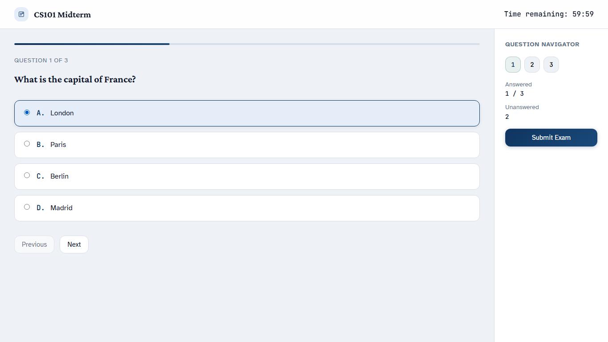

### 8.3. Các thành phần trên màn hình làm bài

| Thành phần | Chức năng |
|------------|-----------|
| **Time remaining** | Thời gian còn lại |
| Thanh tiến độ | Tiến độ duyệt câu hỏi |
| **Question Navigator** | Chuyển nhanh đến câu bất kỳ |
| **Answered / Unanswered** | Số câu đã/chưa trả lời |
| **Submit Exam** | Nộp bài |

Đáp án được tự động lưu sau khi chọn. Nếu tải lại trang, học sinh có thể dùng **Resume** để tiếp tục lượt đang làm.

### 8.4. Nộp bài

1. Kiểm tra số câu **Unanswered**.
2. Nhấn **Submit Exam**.
3. Đọc hộp thoại xác nhận.
4. Xác nhận nộp bài.
5. Chờ hệ thống chấm điểm và chuyển đến kết quả.

> Khi đồng hồ về 0, hệ thống tự động nộp bài. Không tắt trình duyệt hoặc mất kết nối trong thời điểm nộp.

### 8.5. Xem kết quả

Kết quả có thể gồm:

- Tổng điểm đạt được / điểm tối đa.
- Số câu trả lời đúng.
- Trạng thái bài làm.
- Thời điểm nộp.
- Chi tiết từng câu nếu giáo viên cho phép xem đáp án.

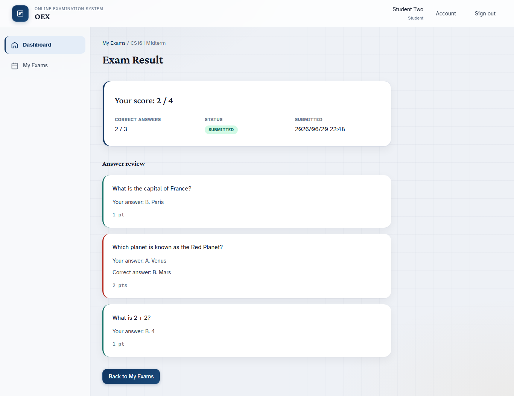

Nhấn **Back to My Exams** để trở về danh sách đề.

---

## 9. Nghiệp vụ Teacher — Xem kết quả

### 9.1. Xem bảng kết quả

1. Đăng nhập Teacher.
2. Vào **Exams** và mở đề cần kiểm tra.
3. Nhấn **View Results**.
4. Xem tên học sinh, email, điểm, điểm tối đa, thời điểm nộp và trạng thái.

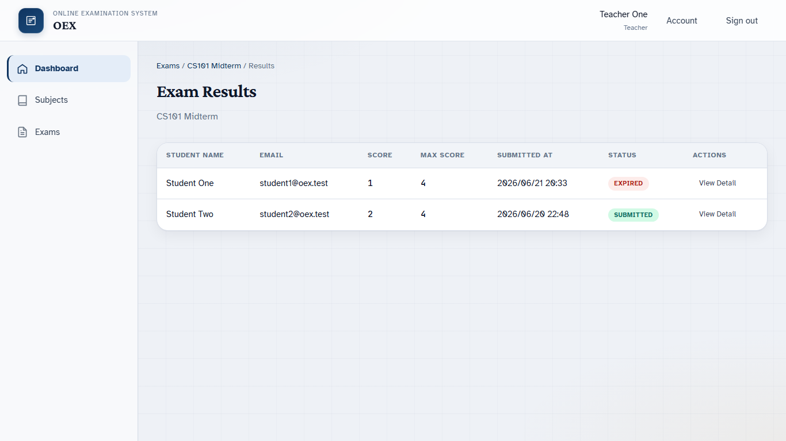

### 9.2. Xem chi tiết bài làm

1. Tại bảng kết quả, chọn **View Detail** cho lượt làm.
2. Xem từng câu hỏi, phương án học sinh chọn, đáp án đúng và số điểm.
3. Quay lại bảng kết quả bằng breadcrumb hoặc nút quay lại.

### 9.3. Đối soát kết quả

Khi cần kiểm tra khiếu nại:

1. Xác nhận đúng học sinh và đúng lượt làm.
2. Kiểm tra trạng thái `SUBMITTED` hoặc `EXPIRED`.
3. Kiểm tra thời gian bắt đầu, hết hạn và thời điểm nộp.
4. Đối chiếu từng câu với điểm cấu hình.
5. Ghi nhận vấn đề cho quản trị kỹ thuật nếu dữ liệu không khớp.

---

## 10. Quy trình nghiệp vụ mẫu từ đầu đến cuối

### Bước 1 — Admin chuẩn bị tài khoản

1. Tạo một Teacher.
2. Tạo một hoặc nhiều Student.
3. Cung cấp thông tin đăng nhập an toàn cho từng người.

### Bước 2 — Teacher chuẩn bị nội dung

1. Tạo Subject.
2. Tạo các câu hỏi MCQ.
3. Kiểm tra mỗi câu chỉ có một đáp án đúng.

### Bước 3 — Teacher tổ chức thi

1. Tạo Exam.
2. Thêm và sắp xếp câu hỏi.
3. Cấu hình thời gian, số lượt làm và quyền xem đáp án.
4. Publish.
5. Assign Students.

### Bước 4 — Student làm bài

1. Đăng nhập.
2. Mở My Exams.
3. Start/Resume.
4. Chọn đáp án.
5. Submit.
6. Xem Result.

### Bước 5 — Teacher tổng hợp

1. Mở Exam Results.
2. Kiểm tra điểm và trạng thái.
3. Mở View Detail khi cần đối soát.

---

## 11. Xử lý tình huống thường gặp

| Hiện tượng | Nguyên nhân thường gặp | Cách xử lý |
|------------|------------------------|------------|
| Không đăng nhập được | Sai thông tin hoặc tài khoản inactive | Kiểm tra email/mật khẩu; liên hệ Admin |
| Không thấy menu theo vai trò | Tài khoản được gán sai role | Admin kiểm tra Role |
| Teacher không thấy môn/đề của người khác | Quy tắc sở hữu dữ liệu | Đăng nhập đúng tài khoản tạo dữ liệu |
| Student không thấy đề | Chưa gán, chưa publish hoặc đề đã đóng | Teacher kiểm tra status và assignment |
| Nút Start không khả dụng | Chưa đến giờ, hết giờ hoặc hết lượt | Kiểm tra thời gian và Max attempts |
| Không sửa được đề | Đề đã Published/Closed | Cấu hình chỉ sửa đầy đủ khi Draft |
| Không xem được đáp án sau nộp | Giáo viên tắt Show answers after submit | Đây là hành vi đúng |
| Token/phiên hết hạn | JWT hết thời hạn | Đăng nhập lại |
| Mất mạng khi làm bài | Request lưu đáp án thất bại | Khôi phục mạng, kiểm tra trạng thái lưu, dùng Resume |
| Điểm chưa hiển thị | Request nộp chưa hoàn thành | Không nộp lặp; tải lại sau khi kết nối ổn định |

---

## 12. Khuyến nghị vận hành

### Admin

- Kiểm tra đúng role trước khi bàn giao tài khoản.
- Vô hiệu hóa ngay tài khoản không còn sử dụng.
- Không dùng chung tài khoản Admin.

### Teacher

- Chuẩn bị và rà soát câu hỏi trước khi Publish.
- Đặt thời gian mở/đóng có khoảng dự phòng.
- Kiểm tra danh sách học sinh được gán trước giờ thi.
- Không thay đổi dữ liệu câu hỏi trong lúc kỳ thi diễn ra.

### Student

- Đăng nhập trước giờ thi để kiểm tra tài khoản.
- Dùng kết nối mạng ổn định và không mở nhiều tab làm cùng một bài.
- Theo dõi **Time remaining** và chủ động nộp trước khi hết giờ.
- Chờ hệ thống hiển thị kết quả/xác nhận sau khi nộp.

---

## 13. Phạm vi phiên bản hiện tại

OEX v1 hỗ trợ:

- Một đáp án đúng cho mỗi câu MCQ.
- Gán đề trực tiếp cho từng học sinh.
- Timer, tự lưu và tự nộp.
- Chấm điểm tự động.
- Ba vai trò Admin, Teacher và Student.

Chưa hỗ trợ:

- Import câu hỏi từ Excel.
- Module lớp học.
- Câu hỏi hình ảnh hoặc nhiều đáp án đúng.
- Xáo trộn câu hỏi/đáp án.
- Chống gian lận hoặc giám sát thi.

---

## 14. Danh mục hình minh họa

| Hình | Nội dung |
|------|----------|
| 01 | Đăng nhập |
| 02 | Dashboard Teacher |
| 03 | Danh sách môn học |
| 04 | Ngân hàng câu hỏi |
| 05 | Form câu hỏi |
| 06 | Danh sách đề thi |
| 07 | Chi tiết đề thi |
| 08 | Kết quả theo đề |
| 09 | Dashboard Admin |
| 10 | Quản lý người dùng |
| 11 | My Exams |
| 12 | Làm bài |
| 13 | Kết quả học sinh |

Toàn bộ ảnh được lưu trong thư mục [`docs/images/`](docs/images/).

---

*Tài liệu hướng dẫn nghiệp vụ OEX — Online Examination System.*
